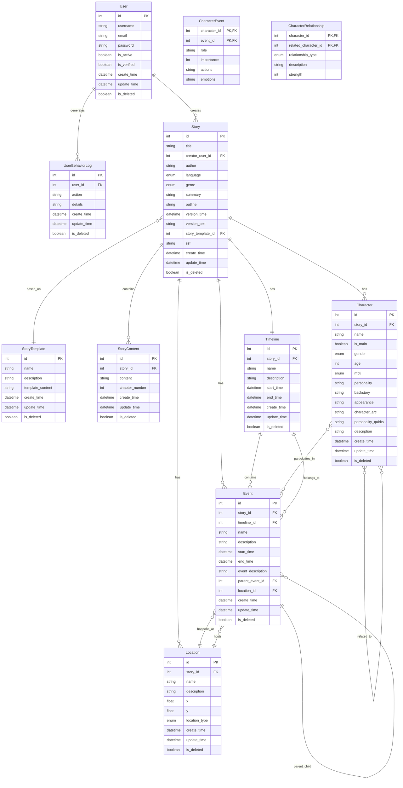

# 数据模型 ER 图

## 实体关系图 (Entity Relationship Diagram)



## 关系说明

### 1. 用户相关
- **User** (用户) - 系统用户，可以创建故事
- **UserBehaviorLog** (用户行为日志) - 记录用户的操作行为

### 2. 故事相关
- **Story** (故事) - 核心实体，包含故事的基本信息
- **StoryTemplate** (故事模板) - 故事可以基于模板创建
- **StoryContent** (故事内容) - 故事的具体章节内容
- **Timeline** (时间线) - 每个故事对应一个时间线

### 3. 事件相关
- **Event** (事件) - 时间线上的事件，支持层级结构
- 事件可以关联地点和角色
- 事件可以有自己的子事件

### 4. 角色相关
- **Character** (角色) - 故事中的角色
- **CharacterEvent** (角色事件关联) - 角色参与事件的详细信息
- **CharacterRelationship** (角色关系) - 角色之间的关系

### 5. 地点相关
- **Location** (地点) - 故事发生的地点，支持坐标定位

## 主要关系类型

### 一对一关系 (1:1)
- Story ↔ Timeline (一个故事对应一个时间线)

### 一对多关系 (1:N)
- User → Story (一个用户可以创建多个故事)
- Story → Character (一个故事可以有多个角色)
- Story → Event (一个故事可以有多个事件)
- Story → Location (一个故事可以有多个地点)
- Timeline → Event (一个时间线可以有多个事件)
- Event → Event (一个事件可以有多个子事件)
- Location → Event (一个地点可以发生多个事件)

### 多对多关系 (M:N)
- Character ↔ Event (通过 CharacterEvent 关联表)
- Character ↔ Character (通过 CharacterRelationship 关联表)

## 枚举类型

### LocationType (地点类型)
- 城市类: CAPITAL, CITY, TOWN, VILLAGE, SETTLEMENT
- 建筑类: PALACE, CASTLE, FORTRESS, TEMPLE, MONASTERY, TAVERN, INN, SHOP, MARKET, WAREHOUSE
- 室内空间: LIVING_ROOM, BATHROOM, KITCHEN, BEDROOM, STUDY, DINING_ROOM
- 自然地理: FOREST, MOUNTAIN, HILL, VALLEY, RIVER, LAKE, OCEAN, DESERT, CAVE, VOLCANO, BEACH
- 战场类: BATTLEFIELD, CAMP, OUTPOST, BORDER
- 其他: RUINS, CEMETERY, GARDEN, PARK, ROAD, BRIDGE, PORT, AIRPORT, OTHER

### RelationshipType (关系类型)
- FAMILY, FRIEND, ENEMY, LOVER, MENTOR, STUDENT, COLLEAGUE, SERVANT, RIVAL

### 其他枚举
- Gender: MALE, FEMALE, OTHER
- MBTI: ISTJ, ISTP, ISFJ, ISFP, INFJ, INFP, INTJ, INTP, ESTJ, ESTP, ESFJ, ESFP, ENFJ, ENFP, ENTJ, ENTP
- Genre: FANTASY, SCIENCE_FICTION, MYSTERY, ROMANCE, THRILLER, HORROR, ADVENTURE, HISTORICAL, CONTEMPORARY
- Language: ZH, EN, JA, KO

## 数据流示例

```
用户创建故事 → 自动生成时间线 → 添加角色和地点 → 在时间线上创建事件 → 关联角色到事件
```

## 查询示例

### 1. 获取故事的完整信息
```sql
SELECT s.*, t.name as timeline_name, 
       COUNT(DISTINCT c.id) as character_count,
       COUNT(DISTINCT e.id) as event_count,
       COUNT(DISTINCT l.id) as location_count
FROM Story s
LEFT JOIN Timeline t ON s.id = t.story_id
LEFT JOIN Character c ON s.id = c.story_id
LEFT JOIN Event e ON s.id = e.story_id
LEFT JOIN Location l ON s.id = l.story_id
WHERE s.id = ?
GROUP BY s.id;
```

### 2. 获取事件的所有参与者
```sql
SELECT c.name, ce.role, ce.importance
FROM Event e
JOIN CharacterEvent ce ON e.id = ce.event_id
JOIN Character c ON ce.character_id = c.id
WHERE e.id = ?;
```

### 3. 获取角色的关系网络
```sql
SELECT c1.name as character, c2.name as related_character,
       cr.relationship_type, cr.strength
FROM CharacterRelationship cr
JOIN Character c1 ON cr.character_id = c1.id
JOIN Character c2 ON cr.related_character_id = c2.id
WHERE cr.character_id = ?;
``` 